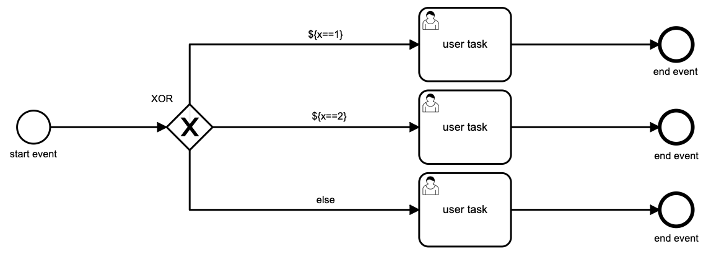
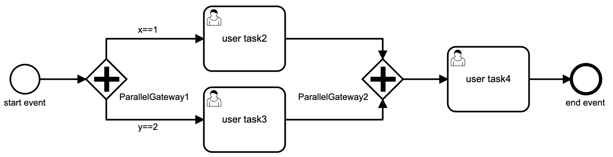
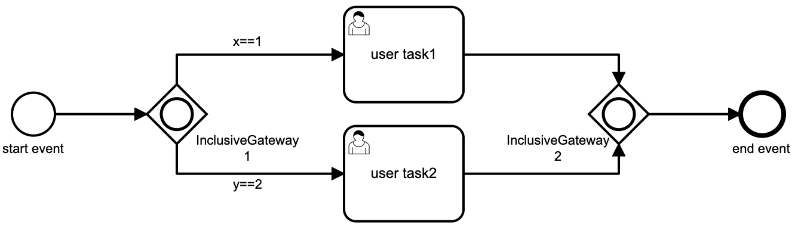

### 网关

##### 排他网关（XOR）

只会走一个分支

会执行每个分支上的条件表达式，流程会沿着执行结果为 true 的分支继续进行，如果有多个为 true，则会选择第一分支进行执行，如果所有都为 false，则报错，但可以设置一个默认分支，这样当都为 false 时则走默认的分支。

##### 并行网关 (Parallel Gateway)

- 并行网关实际上实现了fork  -  join的功能，即在ParallelGateway1处，将流程分支fork成功多个并行分支，在ParallelGateway2处实现join，即每个分支执行到ParallelGateway2处，等到所有的分支都到达ParallelGateway2出后，再继续往下执行
- 如果没有ParallelGateway1，只有ParallelGateway2，则只实现了join，即所有分支到达ParallelGateway2处后，在继续往下执行
- 如果不存在ParallelGateway2，只存在ParallelGateway1，则只实现了fork，没有实现join，此时每个分支单独执行，在此图中，因为没有join，user task4会被执行两次，user task2和user task3，单独执行

##### 包含网关 (Inclusive Gateway)

可看做排他网关跟并行网关的结合，可以在流程分支上定义条件，流程会去执行条件，返回 true 或 false，但它支持多个条件同时为 true，进行并行处理，就像并行网关一样

##### 事件网关

##### 序列流